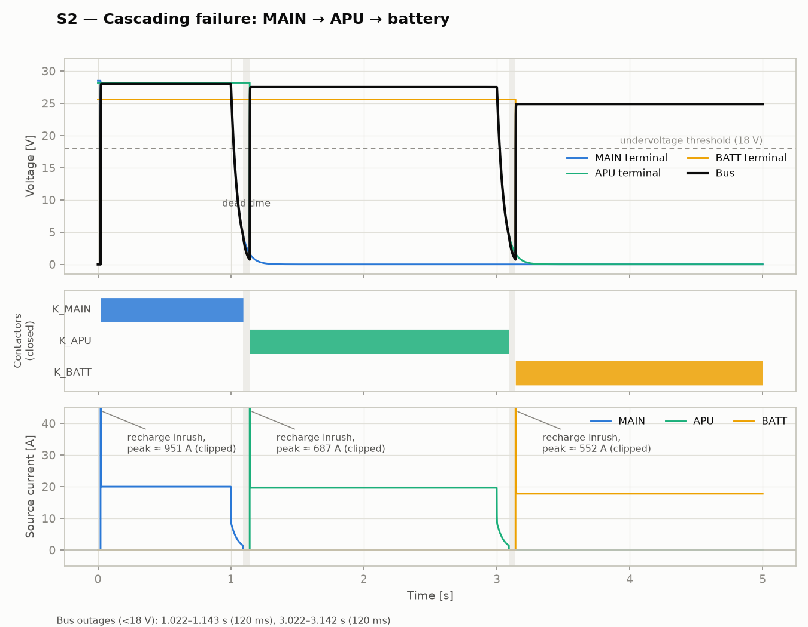
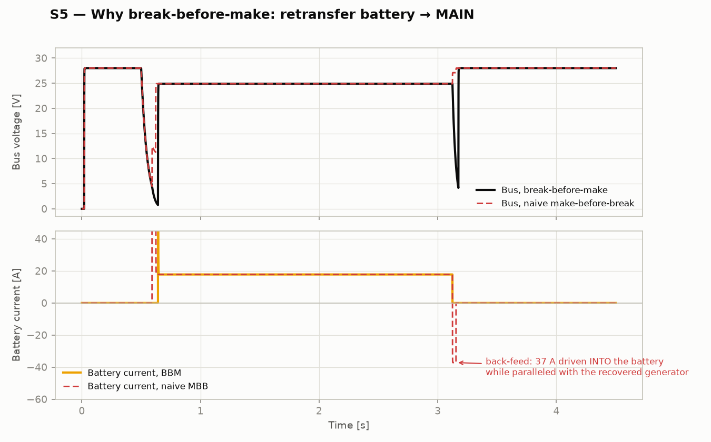

# Automatic Bus Transfer Controller — 28 VDC, three-source

A simulated **automatic bus transfer (ABT) controller** for a single 28 VDC bus fed by
three sources — a main generator, an APU generator, and a battery. On loss of the
active source the controller automatically transfers the bus to the next available
source in priority order (MAIN → APU → BATT), with undervoltage qualification to
reject transients and strict **break-before-make** sequencing to prevent source
paralleling and back-feed.

Built as **original, public-knowledge engineering only** — no proprietary material,
diagrams, bus labels, part numbers, or fault tables from any employer or OEM. The
architecture is the generic textbook DC transfer problem; numeric limits are informed
by the *published* MIL-STD-704 28 VDC envelope and ordinary component physics.



## What's in the repo

```
matlab/
  build_abt_model.m     Programmatically constructs the Simulink/Simscape model
  abt_controller.m      Transfer logic (source injected into a MATLAB Function block)
  abt_params.m          All plant/controller parameters
  run_scenarios.m       Runs scenarios S1–S4 in Simulink, saves plots
python/
  abt_sim.py            Independent reference implementation (plant + controller)
  run_scenarios.py      Runs S1–S5, writes the plots and event log in results/
results/
  s1..s5 *.png          Committed plots (from the Python reference run)
  event_log.md          Machine-generated transfer event timings
```

**Why two implementations?** The Simulink/Simscape model is the deliverable a power
systems group would actually review; the Python implementation is a from-scratch
re-derivation of the same plant equations and the same controller FSM. Agreement
between two independent implementations is a basic verification argument
(same idea as dissimilar-implementation checks in avionics), and it also means the
repo carries **executable, license-free evidence** — every plot in `results/` is
reproducible with nothing but `numpy`/`matplotlib`.

**Why is no `.slx` committed?** `build_abt_model.m` constructs the entire model with
`add_block`/`add_line`. A binary `.slx` can't be code-reviewed or diffed; a build
script can. The script is also the honest form of the deliverable given that it was
authored without a MATLAB license at hand: the electrical topology, block choices and
every connection are explicit in text. (Port names follow the documented Foundation
Library layout; if your release renumbers a conserving port, `add_line` will name the
offending connection.)

## Running it

**Simulink** (R2022b+ with Simscape; Simscape Electrical not required — the network
uses Foundation-library electrical blocks):

```matlab
cd matlab
run_scenarios        % builds abt_model.slx if needed, runs S1–S4, plots to results/matlab/
```

**Python** (no toolboxes):

```bash
pip install -r python/requirements.txt
python3 python/run_scenarios.py      # regenerates results/*.png and event_log.md
```

## System model

```
 MAIN gen  28.5 V ──[25 mΩ]──●── K_MAIN ──┐
                             │(sense)     │
 APU gen   28.2 V ──[35 mΩ]──●── K_APU  ──┼──● 28 VDC BUS ──┬──────┬─────────┐
                             │(sense)     │  │(sense)       │      │         │
 BATTERY   25.6 V ──[40 mΩ]──●── K_BATT ──┘  C_bus 20 mF   R_load  K_step+R_step
                             │(sense)                       1.4 Ω   (+14 A)
```

- Generators are Thevenin equivalents whose EMF follows its command through a 50 ms
  first-order lag — a failure is a **field collapse**, not a step to zero.
- The battery is a constant-EMF Thevenin source (25.6 V, 40 mΩ).
- Contactors are ideal switches with a 20 ms actuation delay.
- The controller runs at 1 kHz, senses each source **upstream of its contactor**, and
  drives the three contactor coils.

### Controller behaviour

| Parameter | Value | Purpose |
|---|---|---|
| Undervoltage (fail) threshold | 18 V (all sources) | below the abnormal-operation floor of a 28 V system |
| Recovery threshold | 25 V (gens), 22 V (battery) | hysteresis; per-source because a 24 V battery never reaches a generator's band |
| Failure qualification time | 50 ms | ride through transients; see S4 |
| Recovery qualification time | 1.0 s | a flaky source must prove itself before retransfer |
| Dead time (break→make) | 50 ms | guarantees the outgoing contactor is open before the incoming one closes |
| Contactor actuation delay | 20 ms | plant, not controller |

FSM: `CONNECTED` ⇄ `DEAD_TIME`. Any mismatch between the connected source and the
highest-priority *healthy* source opens **all** contactors and starts the dead time;
the target is re-evaluated every sample during the dead time, so a source that dies
mid-transfer (cascading fault) is never connected.

## Scenarios & results

Timings below are measured from the simulation (see `results/event_log.md`).

| # | Scenario | Result |
|---|---|---|
| S1 | MAIN fails at t=1.0 s | Transfer to APU complete at 1.142 s; bus < 18 V for **120 ms** |
| S2 | MAIN fails at 1.0 s, APU at 3.0 s | Cascade lands on battery; each transfer 120 ms |
| S3 | MAIN fails, then recovers at 3.0 s | Qualified retransfer at ~4.17 s (1 s proving time); retransfer outage only 38 ms |
| S4 | 30 ms sag on MAIN + 14 A load step | **No transfer** — sag is shorter than the 50 ms qualification |
| S5 | Same retransfer with a deliberately wrong make-before-break controller | 37 A driven **into** the battery during the overlap — the back-feed BBM exists to prevent |

The 120 ms outage decomposes exactly as designed: 50 ms failure qualification
+ 50 ms dead time + 20 ms contactor closing. The 20 ms contactor *opening* time is
absorbed inside the dead time (the dead timer starts at the open command), and the
~22 ms it takes the collapsing EMF to cross 18 V precedes the outage window.



## Design decisions and why

**Break-before-make with a fixed dead time, not diode-ORing or overlap.**
Closing the incoming contactor before the outgoing source is disconnected parallels
two stiff sources at different voltages; current then flows *into* the lower one,
limited only by the two source resistances. S5 measures this: a 30 ms overlap during
battery→MAIN retransfer back-feeds 37 A into the battery (an uncontrolled charge at
whatever voltage the paralleled node settles to). Between two *generators* it would
also fight the regulators. The cost of BBM is a genuine bus outage during the dead
time — that trade is made explicit rather than hidden (see interview Q1).

**Dead time (50 ms) > contactor actuation time (20 ms), with margin.**
The controller has no feedback that a contactor actually opened (no auxiliary
contacts in this model), so the guarantee against overlap is temporal: the incoming
close command is issued only after the dead time, which must exceed the *worst-case
opening* time plus arc-clearing margin. 50 ms vs 20 ms leaves 2.5× margin. Real
contactors open and close with different delays and tolerance bands; the dead time
must be sized against the slow tail of "open" and the fast tail of "close".

**Source-side voltage sensing, upstream of each contactor.**
Sensing between the machine and its contactor means an *offline* source is judged by
its open-circuit voltage — the controller knows the APU is good *before* committing
the transfer, and a recovered MAIN can be qualified for a full second while the bus
runs on APU. Sensing the bus alone could not distinguish "which source failed" from
"bus fault", and could not evaluate a disconnected source at all.

**Undervoltage detection with hysteresis and qualification time (50 ms).**
A single threshold with no timer would transfer on every switching transient, motor
start, or lightning-induced sag. The qualification timer requires the undervoltage to
*persist*; S4 shows a 30 ms sag riding through with no contactor movement. The price
is 50 ms of additional brownout on a real failure. 50 ms was chosen to sit above
normal-transient durations but well below what a 120 ms total outage budget allows.
Hysteresis (fail at 18 V, re-qualify at 25/22 V) prevents chatter around a single
threshold.

**Per-source recovery thresholds.**
A healthy loaded battery sits near 24–25 V and would *never* cross a generator-grade
25 V "healthy" threshold. The battery re-qualifies at 22 V instead. Fail thresholds
stay common at 18 V, below any source's legitimate loaded voltage.

**Automatic retransfer to a recovered higher-priority source — with a 1.0 s proving
time.** Arguments exist both ways. Chosen: auto-retransfer, because battery endurance
is finite and the APU is itself a limited resource, so the system should climb back
up the priority ladder without crew action. The risks are (a) an oscillating transfer
if the recovered source is flaky — mitigated by requiring 1.0 s of continuous healthy
voltage, 20× the failure qualification, and (b) a *second* deliberate outage (38 ms
in S3) on a bus that was perfectly happy — a real design would gate planned
retransfers by load criticality or do them no-break (Q1). Manual-only retransfer is
the conservative alternative; it trades that second outage for crew workload.

**Re-evaluating the transfer target during the dead time.**
Cascading faults can outrun a transfer: if the APU dies while the bus is already
dark en route to it, a latched target would connect the bus to a dead source and
then need a second full cycle. Re-selecting the best healthy source every sample
during `DEAD_TIME` makes the cascade case (S2) just fall out of the same logic.

**Bus hold-up capacitance (20 mF) — and honesty about what it does.**
The capacitor shapes the collapse during the dead time (τ = R_load·C ≈ 28 ms) but
does **not** ride the loads through a 120 ms transfer — the plots show the bus
essentially reaching zero. That is deliberate: an electromechanical ABT is not a
no-break transfer, and pretending a magic capacitor saves the bus would hide the
central design tension. Loads that cannot tolerate the outage need their own hold-up
or a static/no-break feed (Q1).

**Thevenin sources with a first-order field lag; constant-EMF battery.**
A generator loss is dominated by field/regulator collapse, so EMF decays with
τ = 50 ms rather than stepping — this matters because it sets the ~22 ms detection
latency and makes the qualification-timer discussion real. The battery is constant
EMF + internal resistance: over the seconds-long window of a transfer study, state
of charge moves by a few mAh and voltage droop is negligible; an SOC-dependent OCV
would add parameters without changing any transfer behaviour.

**Ideal switches expose a real phenomenon: recharge inrush.**
Closing a contactor onto the discharged bus capacitance draws a large, brief inrush
(hundreds of amps for ~1 ms, limited here only by source resistance — annotated and
clipped in the plots rather than hidden). Physically real in kind, exaggerated in
magnitude because wiring resistance/inductance isn't modelled. A production design
handles it with precharge resistors, current-limited closing, or accepts it within
contactor make ratings (Q5).

**Discrete 1 kHz controller.**
The controller is deliberately sampled (1 ms) rather than continuous: every
qualification and dead-time constant is an integer number of ticks, which is how a
real supervisory MCU/FPGA would implement it, and it makes the MATLAB Function and
Python implementations bit-for-bit comparable. All plant dynamics of interest are
≥ 20 ms, so 1 kHz is comfortably fast.

**Failure injection at the EMF command, not by deleting blocks.**
Scenarios drive each source's EMF target as a timeseries (collapse to 0 = failure,
restore = recovery, brief dip = sag). One mechanism covers every scenario including
partial sags, and the model itself never changes between runs — only data does.

## Known limitations (a.k.a. the next work packages)

- **No bus-fault discrimination**: a shorted bus looks like a source failure and the
  controller would sequentially try every source into the fault (see interview Q3).
  Needs overcurrent detection and a transfer-inhibit/lockout.
- **No contactor position feedback** (auxiliary contacts), so no weld/failure-to-open
  detection — the dead time is trusted, not verified.
- **No load shedding** when on battery, and no battery SOC/endurance model.
- Contactor open/close delays are equal; real devices are asymmetric.
- No DO-160-style transient/interrupt test set against the load side.
- The controller itself is a single point of failure — no redundant channel.

## How this would be challenged in an interview

**Q1 — "Your transfer black-outs the bus for 120 ms. What happens to the loads, and
what would you do for loads that can't take it?"**
Anything electromechanical (relays held by the bus, fuel pumps, heaters) rides
through or restarts harmlessly; the problem is digital avionics. The classic
requirement (DO-160 §16 power-interruption categories) forces equipment to tolerate
interruptions on the order of 50–200 ms — which is *why* a 120 ms ABT can be
acceptable at all: the interruption budget is allocated to the equipment, not the
bus. For loads that genuinely can't gap: give them local hold-up (their own
capacitance/battery through isolation diodes), feed them from a diode-OR'd
essential feed off two buses, or use a static (solid-state) transfer switch whose
transfer time is sub-millisecond. The honest system-level answer is that the outage
is a *budget* negotiated between bus design and equipment qualification, not a
number to minimize in isolation.

**Q2 — "Why a controller at all? Diode-OR the three sources and you get automatic,
glitchless selection with zero logic."**
Passive ORing fails this application on four counts. (1) The diode drop: 0.7–1 V of
a 28 V bus is ~3 % loss — at 20 A that's ~15–20 W of heat per feed, continuously.
(2) Priority is voltage-ordered, not designed: the highest-*voltage* source wins, so
you can't prefer MAIN over APU at equal setpoints, and the battery silently picks up
load during every generator sag instead of being a managed last resort. (3) No
isolation decisions: a source that fails *shorted* is isolated by a diode, but a bus
fault still discharges every source into it with no element authorized to open.
(4) No observability — nothing announces that you're now on battery with 30 minutes
of endurance. Active ORing controllers (ideal-diode MOSFETs) fix the drop but not
the policy problems. The controller exists to encode *policy*: priority,
qualification, sequencing, annunciation.

**Q3 — "A bus short circuit looks exactly like a source failure to your undervoltage
logic. Walk me through what your controller does, and why that's bad."**
It cascades into the fault: the bus (= sensed terminal voltage of the connected
source) collapses, MAIN is declared failed, the dead time runs, the APU — healthy at
open circuit — is connected into the short, collapses, is declared failed, and the
battery follows. Every source gets a 50 ms + dead-time excursion into a bolted
fault. The fix is to make transfer conditional on fault discrimination: an
undervoltage *with* high source current (or a current step at collapse) indicates a
downstream fault, which must **inhibit** transfer and instead trip/lock out the bus;
undervoltage with *low or collapsing* current indicates a dead source, which is the
legitimate transfer case. This is the standard UV-plus-overcurrent supervision
pairing, and its absence here is the model's most consequential simplification —
I'd rank it the first thing to add.

**Q4 — "You never verify a contactor actually opened. What if K_MAIN welds closed?"**
As built, the controller trusts time: it commands open, waits 50 ms, and closes the
next source — if K_MAIN has welded, that closes APU onto a faulted-or-live MAIN feed
and creates exactly the paralleling/back-feed event BBM exists to prevent (S5 shows
the magnitude for the battery case). The production answer is closed-loop
sequencing: auxiliary (position) contacts on each contactor, and the make command
gated on *confirmed* open of the outgoing device with a timeout → failure
annunciation and transfer abort into a safe state. Weld detection (commanded open,
aux says closed, or current still flowing) becomes a latched fault that removes that
path from the priority list. The FSM here extends naturally — `DEAD_TIME` acquires
an exit condition on aux-contact feedback rather than a timer alone — which is why I
kept the sequencing explicit rather than event-triggered.

**Q5 — "Your plots admit a 950 A inrush when a contactor closes. Defend that number
or fix it."**
The number is honest for the model and wrong for an aircraft. It's V/R_source into a
fully discharged 20 mF with zero line impedance — the model omits feeder resistance
and inductance (tens of mΩ and µH for a real 28 V feeder), which would cut and
slow the peak substantially, and real contactors carry make-ratings specified for
exactly this duty. What I'd actually change in order: (1) add feeder R/L per branch
so the peak becomes a computed, defensible number; (2) check it against the
contactor's make rating and the capacitor's surge rating; (3) if still offensive,
precharge the bus capacitance through a resistor before the main contacts make, or
distribute the capacitance to the load side behind local inrush limiters. I left
the artifact visible and annotated rather than quietly clipping the capacitance,
because the *first* thing a reviewer should see is where the model ends and the
hardware begins.

---

*Independent educational/portfolio project. Original work; no proprietary material.*
